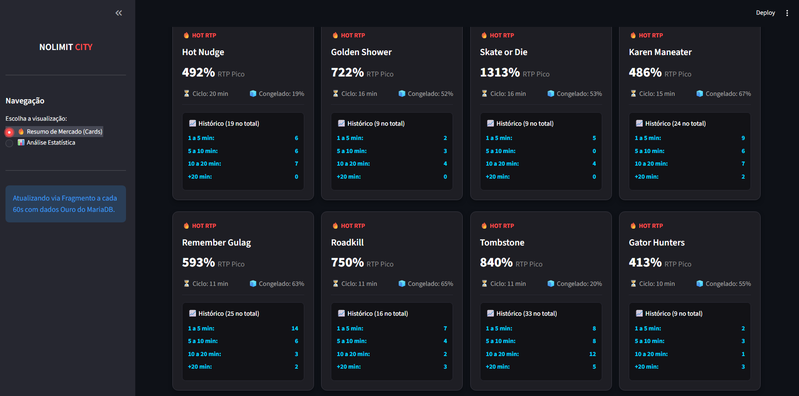
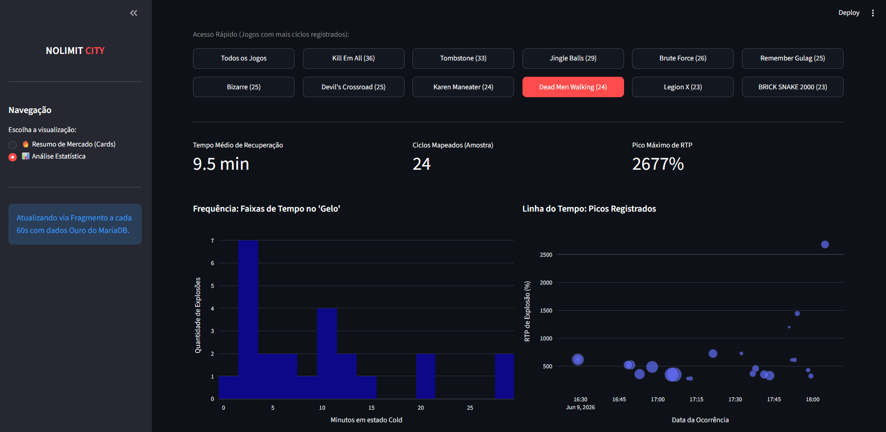

# 🎰 Radar de Volatilidade: Data Pipeline end-to-end (Nolimit City)

## 1. Visão Geral do Projeto
Este projeto consiste no desenvolvimento de uma aplicação de dados (Data App) em tempo real que captura, processa e analisa flutuações de RTP (*Return to Player*) instantâneas em jogos de slots de alta volatilidade da provedora Nolimit City. 

O objetivo central é mapear o tempo médio que um jogo leva para sair de uma janela de retenção de prêmios (*Cold*) e entrar em uma janela de pico de distribuição (*Hot*), fornecendo análises preditivas básicas através de uma interface web interativa.

## 2. Arquitetura da Solução (Medallion Architecture)
O projeto foi estruturado seguindo as melhores práticas de Engenharia de Dados, separando a ingestão, o armazenamento e a visualização:

* **Camada de Ingestão:** Web Scraper desenvolvido em Python com Selenium para extração contínua e assíncrona de dados estruturados do painel ao vivo da provedora.
* **Camada Bronze (Armazenamento Bruto):** Banco de dados relacional (MariaDB/MySQL) armazenando o histórico minuto a minuto das flutuações de mercado.
* **Camada Ouro (ETL e Agregação):** Script automatizado em Python que limpa ruídos de dados e consolida ciclos fechados de volatilidade em uma tabela exclusiva otimizada para queries analíticas e modelos preditivos.
* **Camada de Visualização:** Dashboard interativo em tempo real construído com Streamlit e Plotly, utilizando fragmentos (`@st.fragment`) para atualização assíncrona sem recarregamento da página.

## 3. Como Executar o Projeto Localmente

### Pré-requisitos
* Python 3.8+
* Servidor MySQL/MariaDB rodando localmente.
<<<<<<< HEAD

## 3. Demonstração Visual (Interface UI/UX)

A interface foi projetada utilizando conceitos de *Glassmorphism* e Dark Mode nativo para reduzir o cansaço visual, simulando terminais profissionais de monitoramento de dados em tempo real.

### 🃏 Visão Macro: Resumo de Mercado em Tempo Real
Neste painel, o algoritmo exibe os últimos jogos a saírem do estado de retenção (*Cold*) para o estado de pagamento (*Hot*), organizados em um mosaico responsivo de cards.
* **Inteligência de Contexto:** Cada card não mostra apenas o evento de explosão atual, mas varre o banco de dados para exibir um mini-histórico de frequência daquele jogo específico. Isso permite ao analista bater o olho e saber instantaneamente se o ciclo atual está dentro da média histórica ou se representa uma anomalia estatística.

---

### 📊 Visão Micro: Análise Estatística Integrada
Uma aba dedicada a investigações profundas de jogos isolados, utilizando memória de sessão (`st.session_state`) e visualização *split-screen* (lado a lado) para otimizar o cruzamento de dados.
* **Acesso Rápido e KPIs:** Botões interativos de filtro já exibem o volume total de amostras capturadas para cada jogo. Ao selecionar um ativo (ex: *Dead Men Walking*), as métricas de topo (Tempo Médio, Volume da Amostra e Pico Máximo) são recalculadas em milissegundos.
* **Cruzamento Visual:** Do lado esquerdo, o **Histograma** exibe a distribuição de frequência de tempo no "Gelo", provando qual é a faixa de tempo mais comum para aquele jogo estourar. Do lado direito, o **Gráfico de Dispersão** mapeia os picos na linha do tempo (o tamanho da bolha indica o tempo que o jogo passou acumulando antes da explosão).

=======
>>>>>>> 67d676816d839e4e1ee4add414bf8859e0e17a18
